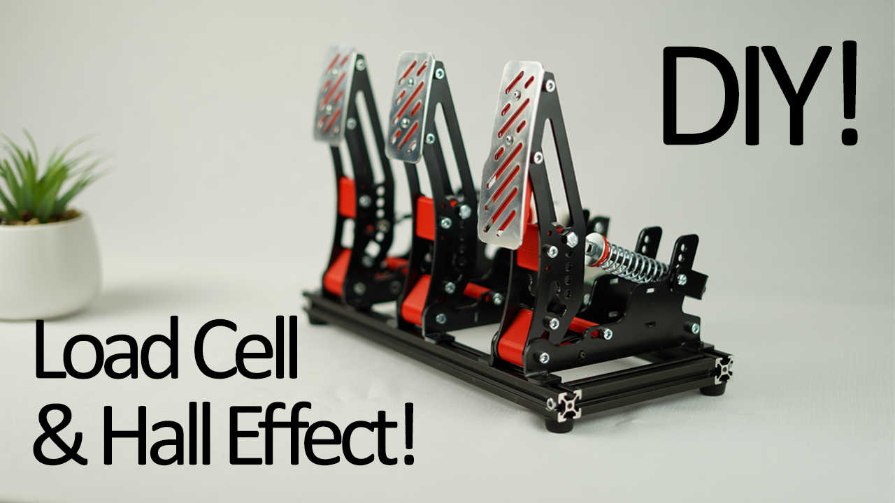

# CNCDan - Sim Pedals
A laser cut, 3D printed, hall effect and load cell compatible racing simulator pedal design.

This project is part of my DIY Sim racing series. The aim was to create a high quality set of sim racing pedals with no compromises, as cheaply as possible!

All of the pedal bodies are interchangeable so you can build any combination of pedals you wish. Hall effect and load cells are supported by all pedals so you can pick and choose what you feel will work best.

There are two folders that contain the parts you will need, Metal components and Printed components. The printed components are just .STL files and have quantities in their file names assuming a standard 3 pedal setup. For the metal components I have provided a STEP and DXF file for each part and a PDF with basic folding instructions for the folded parts which should be enough information for any cut service.

There are two different types of pedal plates included. Printed and metal. If you aren't using the metal version, there is no need to print the pedal mounts or the pedal form as the printed pedals incorporate the mount and the plate into one part. 

If you're planning to fold your own parts, you can just order 6x of the "3mm Pedal Base Plate" and ignore the "3mm Pedal Base Plate Mirrored" file as they are identical parts just folded the opposite direction. This will save you some money!

I've not included any software yet but I will once I integrate the pedals, shifter and wheel all into one device.

Link to video: https://youtu.be/44LWekyILmk

#### Bill of Materials

6x 625 Bearings - https://www.aliexpress.com/item/1005006600483688.html

2x 6x2 Magnets - https://www.aliexpress.com/item/1005008893908031.html

2x Hall Effect Sensor - https://www.aliexpress.com/item/1005006061649001.html

1x NA151 Load Cell 200kg - https://www.aliexpress.com/item/1005005510555008.html

1x HX711 Load Cell Amp - https://www.aliexpress.com/item/1005006851380544.html

3x M6 Female Rod End (Si6M6) - https://www.aliexpress.com/item/1005004112779993.html

3x 6x12x8 Retaining Collar - https://www.aliexpress.com/item/1005004975920947.html

2020 Extrusion (2x 370mm, 2x 130mm) - https://www.aliexpress.com/item/1005004263746376.html

4x 2020 corner brackets - https://www.aliexpress.com/item/1005007297685965.html

#### Nuts, Bolts and Washers

9x M5x50 SHCS

15x M5x40 SHCS

3x M6x40 SHCS

3x M6x130 SHCS (Minimum length, can be longer)

21x M5 Nuts

6x M5 Nyloc Nuts

6x M6 Nuts

6x M4x16 BHCS (used only for metal pedal plates)

12x M5 Washers

3x M6 Large Washers
